# Exam Management System

The Exam Management System is a comprehensive tool designed to create and maintain multiple-choice meta questions. 
It supports exam creation and provides a user-friendly catalog for viewing exams.

## Table of Contents
- [Overview](#overview)
- [Architecture](#architecture)
  - [Rest API Server](#rest-api-server)
  - [LaTeX Compiler Server](#latex-compiler-server)
  - [React Client](#react-client)
- [Features](#features)
- [Installation](#installation)
- [Usage](#usage)
- [Contributing](#contributing)

## Overview

### Users

The Exam Management System includes three types of users:

Lecturer: Responsible for the exams and has the final say on changes to meta questions.
Teaching Assistant (TA): Responsible for validating and creating meta questions.
Admin: Responsible for maintaining user accounts.

### Meta Questions

The system is responsible for creating and maintaining multiple-answer meta questions. 
Each question consists of:
- **Stem**: The main body of the question.
- **Keys**: The correct answers.
- **Distractors**: The incorrect answers.
- **Keywords**: Tags that help filter meta questions for easy filtering.
- **Appendix**: Additional information or resources (optional).

### Exams 
The system also facilitates the creation of exams and saves them in a catalog that is easy to navigate.

The Exam Management System streamlines the process of exam creation:

- **Select Stems**: The user selects stems from the pool of questions.
- **Generate Questions**: The system automatically rolls out distinct keys (correct answers) and distractors (incorrect answers) from the pool to create exam questions.
- **Multiple Variations**: The system generates multiple variations of the exam, shuffling the answers in each variation to ensure uniqueness and reduce the chances of cheating.

### Tasks
The Exam Management System includes a tasks feature that allows Teaching Assistants (TAs) to request tasks:

- **Task Requests**: TAs can ask for work through the system.
- **Task Assignment**: The system assigns tasks to TAs, which may include validating existing meta questions or creating new questions based on a given keyword or keywords.

## Architecture

The Exam Management System consists of two servers and a React client.

### Rest API Server

The Rest API server handles all data manipulation and storage. It includes the following modules, each with backend (BE) and data access layers (DAL):

- **User Manager**: Manages user data and authentication.
- **Task Manager**: Manages tasks and assignments related to exam creation.
- **MetaQuestion Manager**: Handles the creation and management of meta questions.
- **Exam Manager**: Manages exam creation, storage, and retrieval.

### LaTeX Compiler Server

The LaTeX Compiler server converts LaTeX code into PDF format. This is useful for generating professional-looking exam papers.

### React Client

The React client provides a user interface for interacting with the system. It includes the following pages:

- **index**: Home page.
- **course-staff**: Page for course staff to manage exams and questions.
- **generate-exam**: Interface for generating new exams.
- **past-exams**: Catalog of past exams.
- **admin**:
  - **users**: Manage user accounts.
- **auth**:
  - **login**: User authentication page.
- **catalog**:
  - **appendices**: Manage appendices.
  - **questions**: Manage questions.
- **create**:
  - **appendix**: Create new appendices.
  - **appendix-plus-question**: Create appendices and questions together.
  - **choose-appendix**: Select appendices for questions.
- **work**:
  - **tag**: Manage tags for questions.

## Features

- Create and manage multiple-answer meta questions.
- Generate and manage exams.
- Convert LaTeX code to PDF for professional exam documents.
- User-friendly catalog for viewing meta-questions and past exams.
- Comprehensive user management for administrators.
- Tasks feature for assigning work to Teaching Assistants.

## Installation

To install the Exam Management System, follow these steps:

1. Clone the repository.
2. Install dependencies for the Rest API server, LaTeX Compiler server, and React client.
3. Configure environment variables as required.
4. Run the servers and the client.

## Usage

1. Log in with your credentials (you may need to update your password).

2. Navigate to the home page. Use the side Bar to navigate the system:
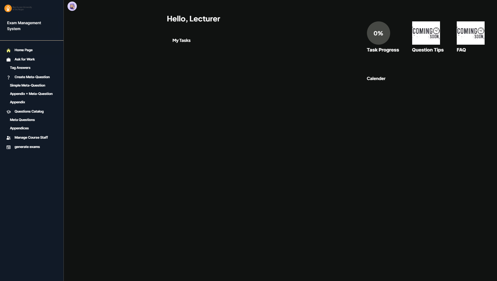
3. create new Meta Questions:
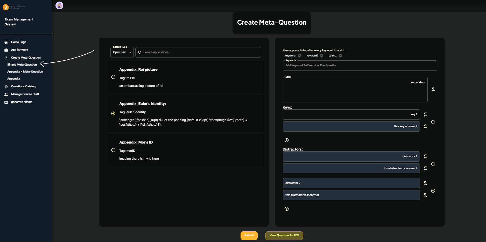
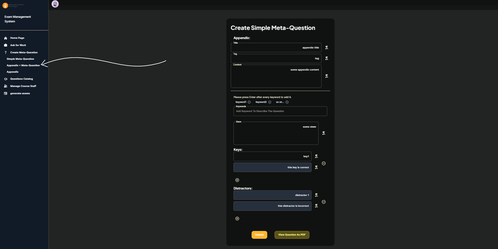
4. view your meta-questions in the catalog - do notice you can edit and delete each question as well as viewing the
compiled quesrtion
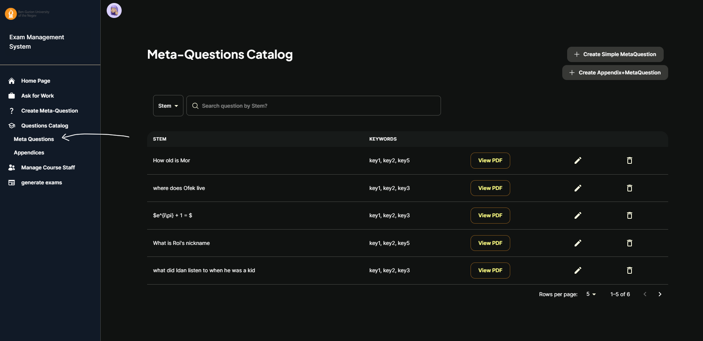
5. view your appendixes - pressing one of the rows will show you the questions related to he appendix
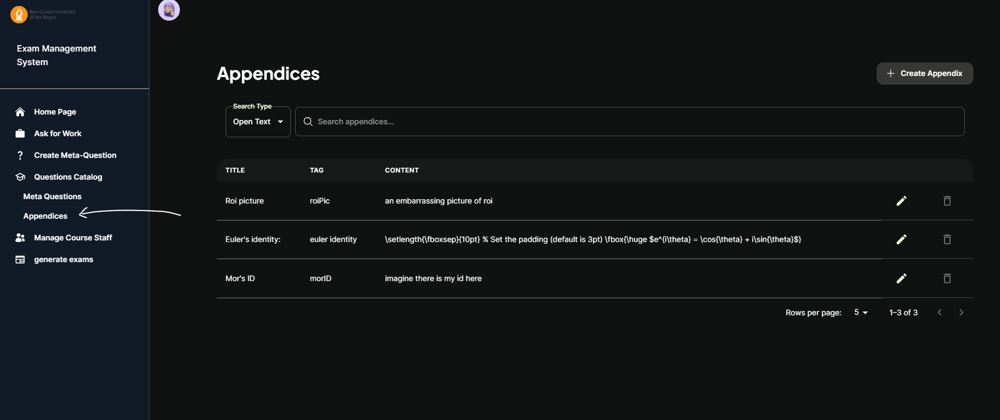
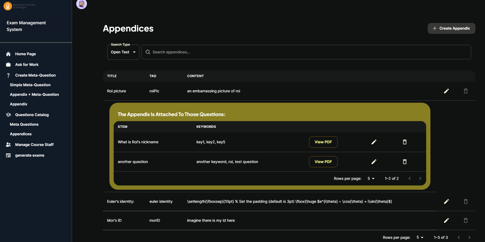
6. ask for work tagging an answer as key or distractor
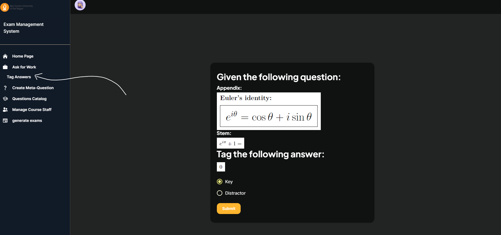
7. generate exam
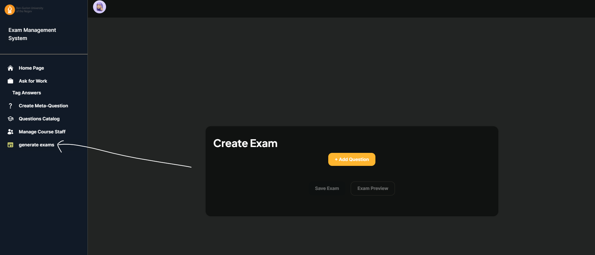
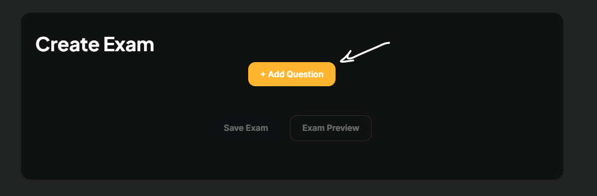
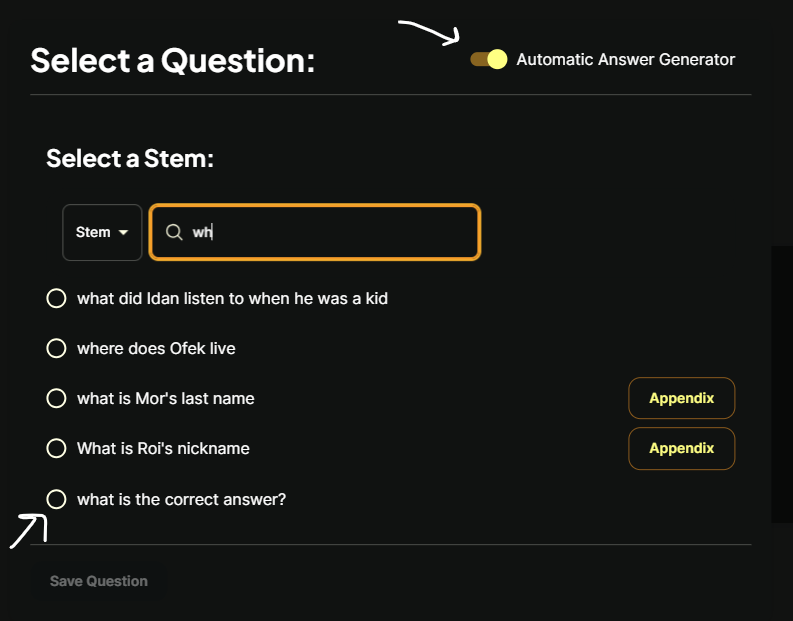
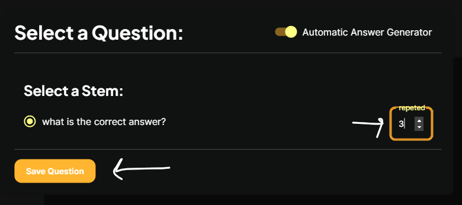
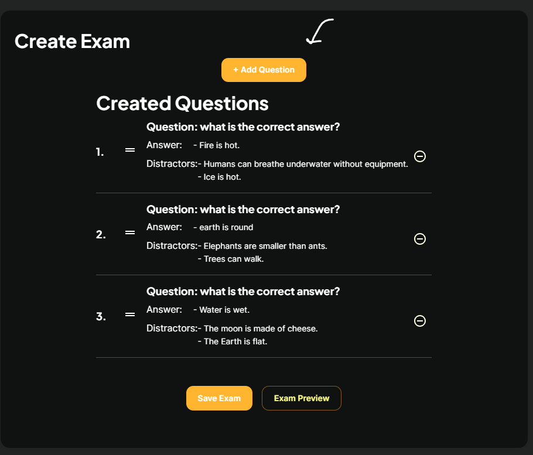
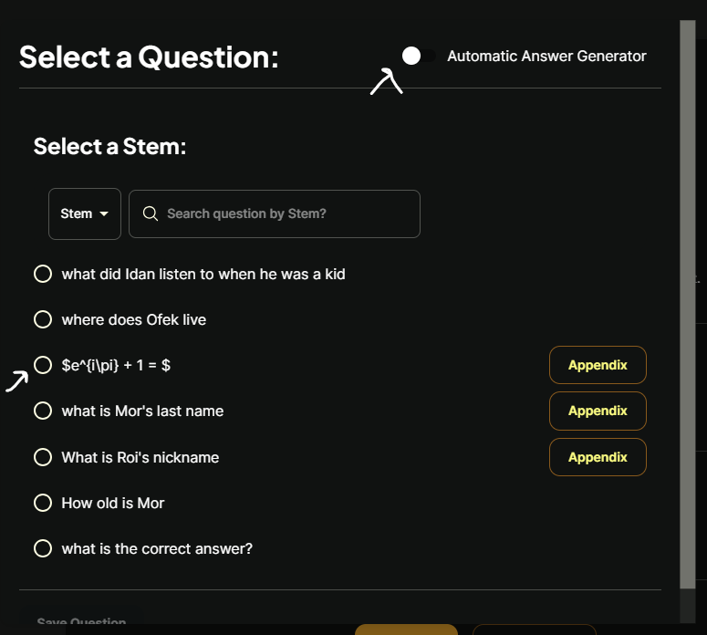
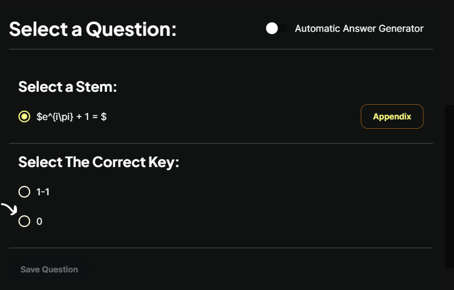
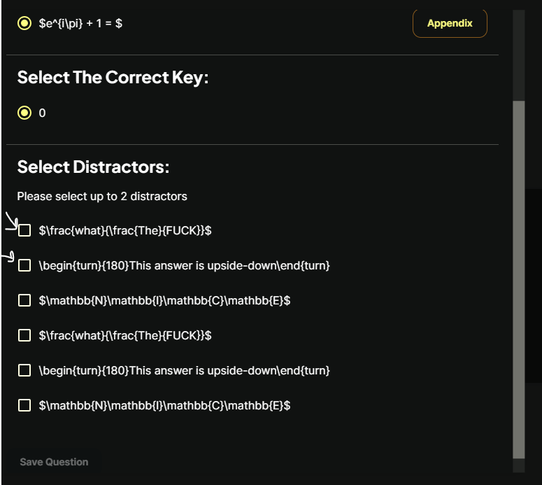
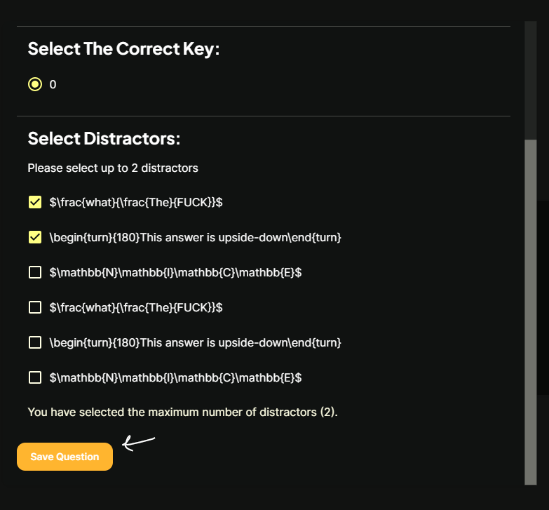
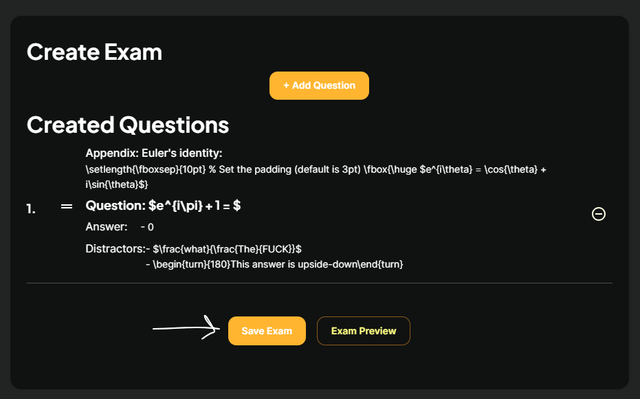
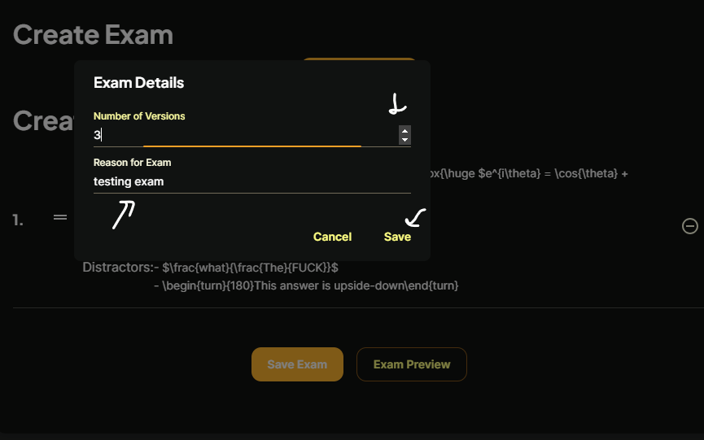
8. view the exams the past exams tab 

## Contributing

We welcome contributions to the Exam Management System. To contribute, follow these steps:

1. Fork the repository.
2. Create a new branch.
3. Make your changes.
4. Submit a pull request.
